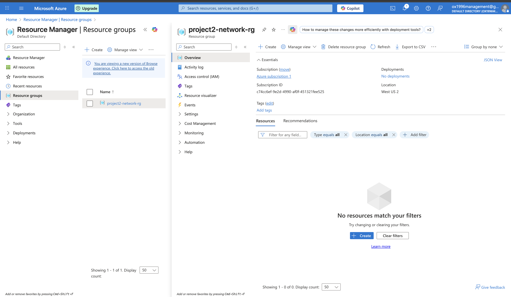
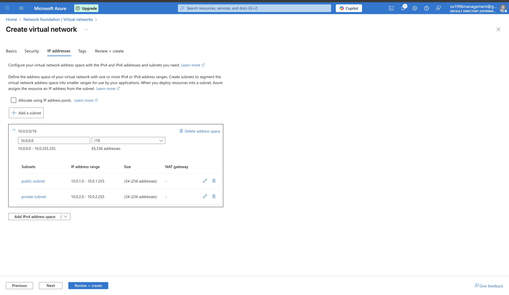
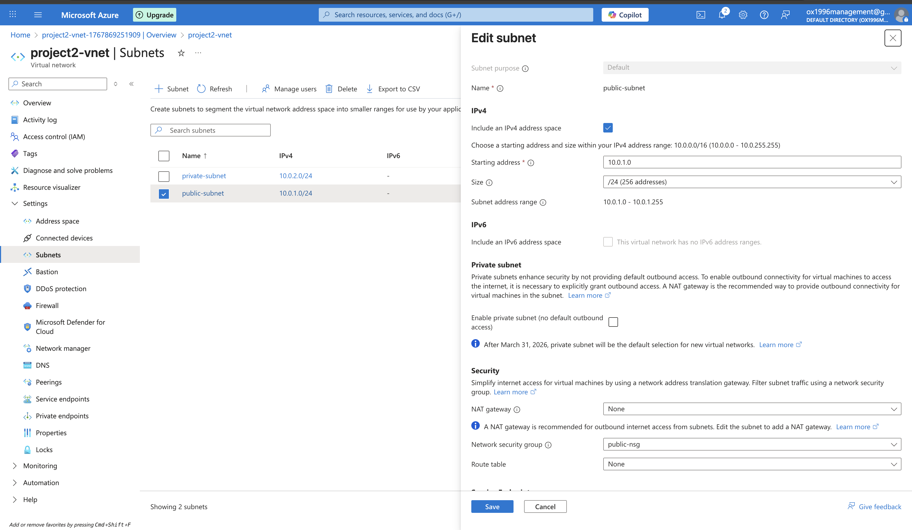
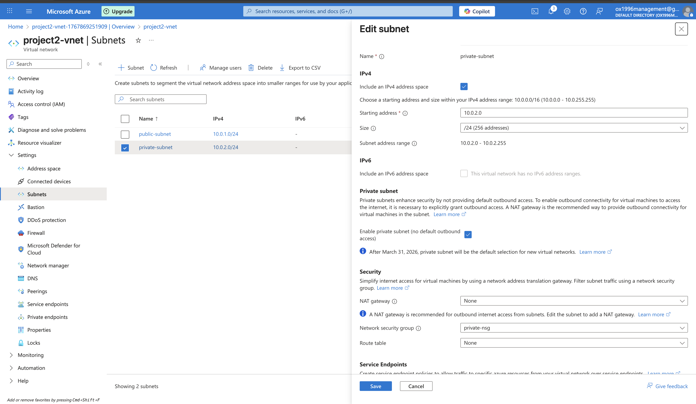
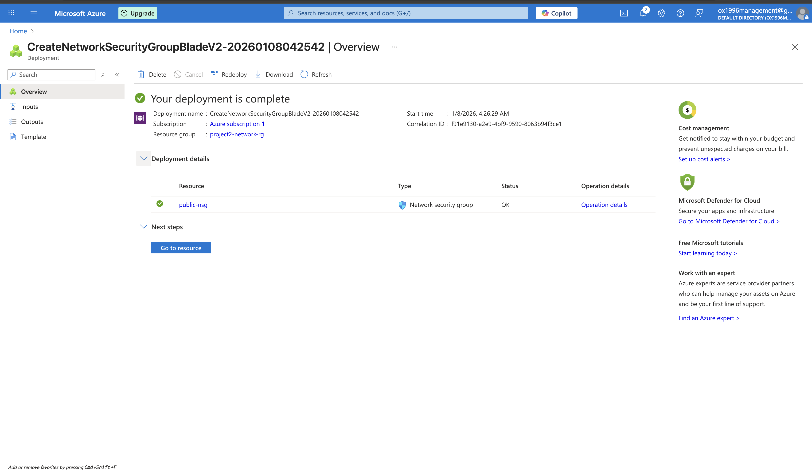
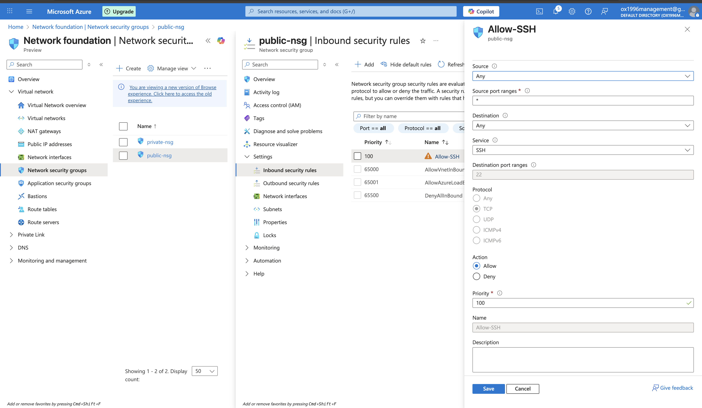
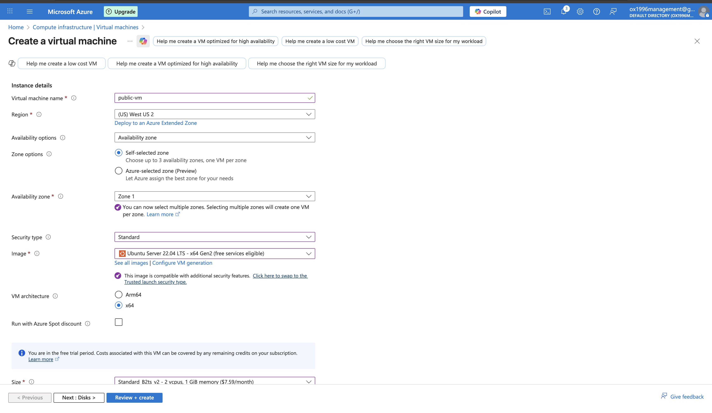
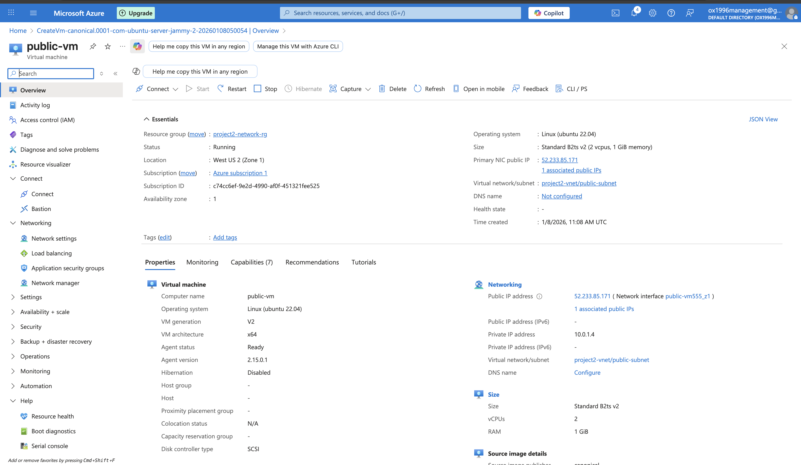
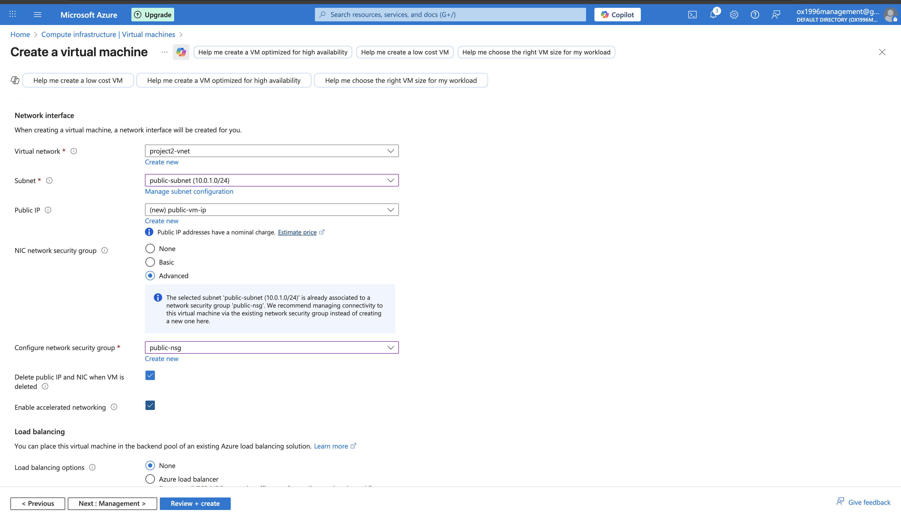
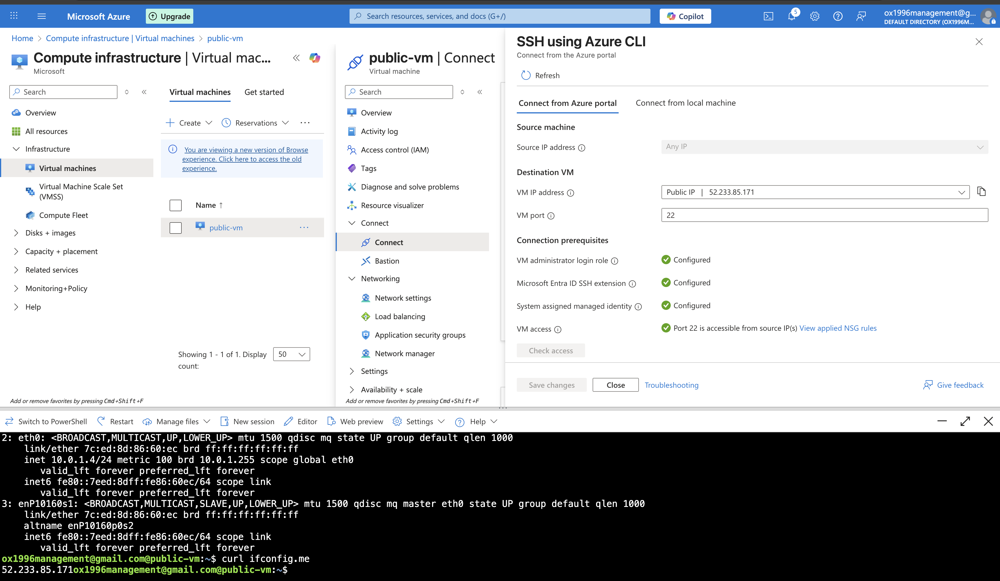

# Azure Public vs Private Networking (Azure Virtual Network)

## Overview
This project demonstrates how to design a secure Azure Virtual Network (VNet – Virtual Network) with a public subnet and a private subnet, apply Network Security Group (NSG – Network Security Group) rules, and validate secure access using Secure Shell (SSH – Secure Shell).

---

## Architecture
Azure Virtual Network (VNet – Virtual Network)

- Public Subnet (10.0.1.0/24)
  - Public Virtual Machine (VM – Virtual Machine)
  - Network Security Group (NSG – Network Security Group) allowing SSH

- Private Subnet (10.0.2.0/24)
  - Private Virtual Machine (VM – Virtual Machine)
  - Restricted Network Security Group (NSG)

---

## Tools & Technologies Used
- Microsoft Azure Portal
- Azure Virtual Network (VNet)
- Subnets (Public and Private)
- Network Security Groups (NSGs)
- Azure Virtual Machines (VMs)
- Ubuntu Linux
- Secure Shell (SSH)
- Azure Cloud Shell

---

## Project Build Steps
1. Created a Resource Group (RG): project2-network-rg
2. Created a Virtual Network (VNet): project2-vnet
3. Created two subnets:
   - public-subnet (10.0.1.0/24)
   - private-subnet (10.0.2.0/24)
4. Created Network Security Groups and associated them with subnets
5. Deployed a public virtual machine
6. Verified secure connectivity and network behavior

---

## Validation & Proof

### SSH Access
Connected to the public virtual machine using SSH via Azure Cloud Shell.

### Hostname Verification
```bash
hostname
## Screenshots

### Resource Group & Networking Setup





---

### Network Security Groups (NSGs)




---

### Public Virtual Machine Deployment




---

### SSH Access & Validation

