# Azure Public vs Private Networking (Azure Virtual Network)

## Overview
This project demonstrates how to design a secure Azure Virtual Network (VNet – Virtual Network) with a public subnet and a private subnet, apply Network Security Group (NSG – Network Security Group) rules, and validate secure access using Secure Shell (SSH – Secure Shell).

---

## Architecture
Azure Virtual Network (VNet – Virtual Network)

- Public Subnet (10.0.1.0/24)
  - Public Virtual Machine (VM – Virtual Machine)
  - Network Security Group (NSG – Network Security Group) allowing SSH

- Private Subnet (10.0.2.0/24)
  - Private Virtual Machine (VM – Virtual Machine)
  - Restricted Network Security Group (NSG)

---

## Tools & Technologies Used
- Microsoft Azure Portal
- Azure Virtual Network (VNet)
- Subnets (Public and Private)
- Network Security Groups (NSGs)
- Azure Virtual Machines (VMs)
- Ubuntu Linux
- Secure Shell (SSH)
- Azure Cloud Shell

---

## Project Build Steps
1. Created a Resource Group (RG): project2-network-rg
2. Created a Virtual Network (VNet): project2-vnet
3. Created two subnets:
   - public-subnet (10.0.1.0/24)
   - private-subnet (10.0.2.0/24)
4. Created Network Security Groups and associated them with subnets
5. Deployed a public virtual machine
6. Verified secure connectivity and network behavior

---

## Validation & Proof

### SSH Access
Connected to the public virtual machine using SSH via Azure Cloud Shell.

### Hostname Verification
```bash hostname
```
## Resource Group & Networking Setup

### Resource Group Created
This screenshot shows the Azure Resource Group that contains all networking resources for this project.


---

### Virtual Network Created
This screenshot shows the Azure Virtual Network (VNet) and its address space.


---

### Public Subnet
This screenshot shows the public subnet where the public virtual machine is deployed.


---

### Private Subnet
This screenshot shows the private subnet with no public internet access.


---
---

## Project 2 – Azure Networking (Part 2: Private VM)

In this section, I created a **private virtual machine** in Azure and verified that it cannot be accessed directly from the internet.  
I then confirmed that the private VM is only reachable through a **public jump host VM**, following secure cloud networking best practices.

---

### Step 1: Create the Private Virtual Machine (Basics)
I created a new Linux virtual machine named **private-vm**, selected the correct resource group and region, and confirmed no public inbound ports were enabled.

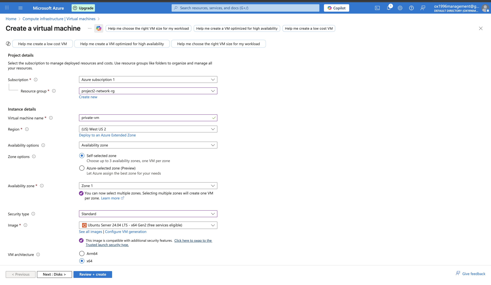

---

### Step 2: Configure VM Size and Authentication
I selected the virtual machine size and configured the administrator username and password authentication.

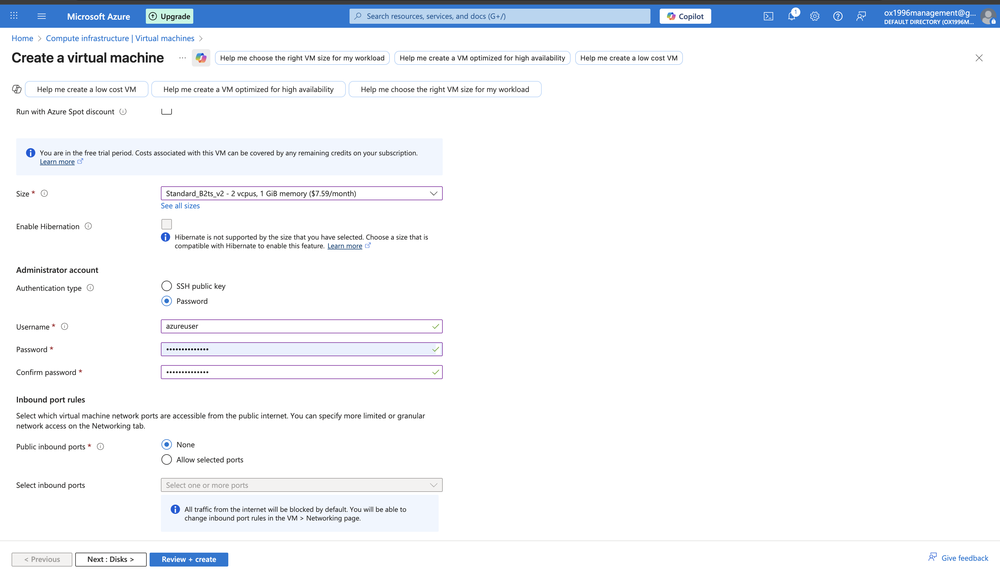

---

### Step 3: Configure Networking for the Private VM
I placed the virtual machine inside the **private subnet** to ensure it does not receive a public IP address.


---

### Step 4: Configure Management Settings
I reviewed the management options and left default settings enabled without adding identity or automation features.

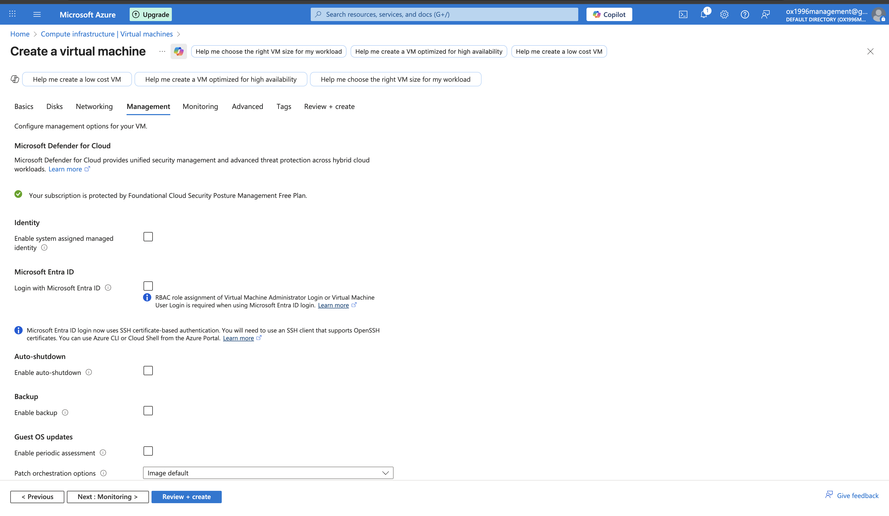

---

### Step 5: Configure Monitoring Settings
I reviewed monitoring settings and kept boot diagnostics disabled to keep the configuration minimal.

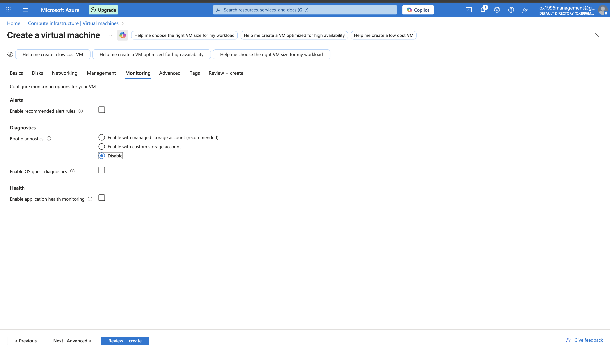

---

### Step 6: Review Advanced Settings
I reviewed the advanced settings and confirmed no extensions or custom data were added.

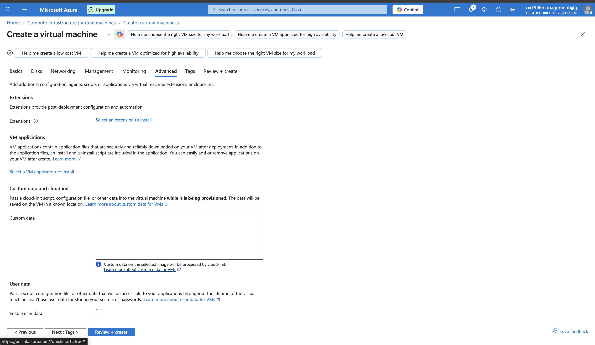

---

### Step 7: Add Resource Tags
I added a project tag to help organize and identify this virtual machine.

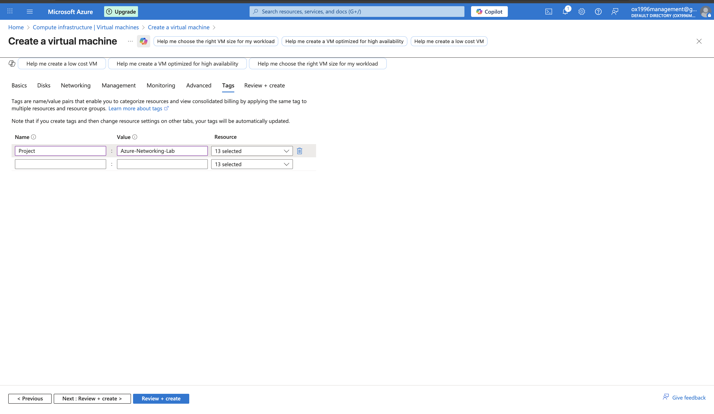

---

### Step 8: Deploy the Private Virtual Machine
I reviewed the configuration and started the virtual machine deployment.

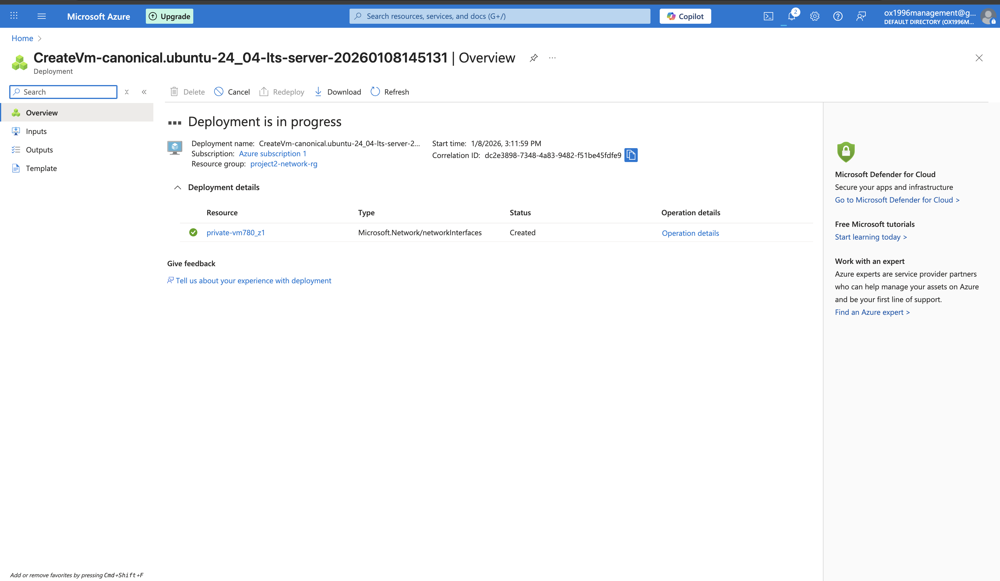

---

### Step 9: Confirm Deployment Completion
I confirmed that the deployment completed successfully and the private virtual machine was created.

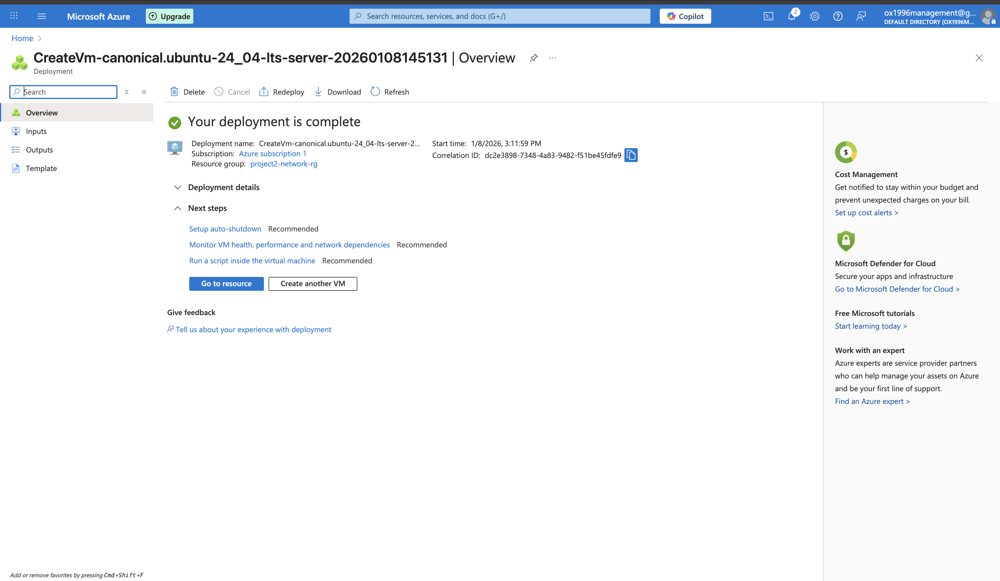

---

### Step 10: Verify Private VM Overview
I verified that the private virtual machine is running and does **not** have a public IP address assigned.

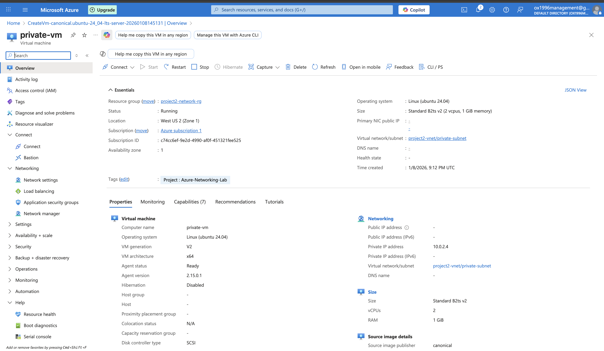

---

### Step 11: Verify Private IP and Networking
I confirmed the private IP address and verified that the VM is attached to the private subnet.

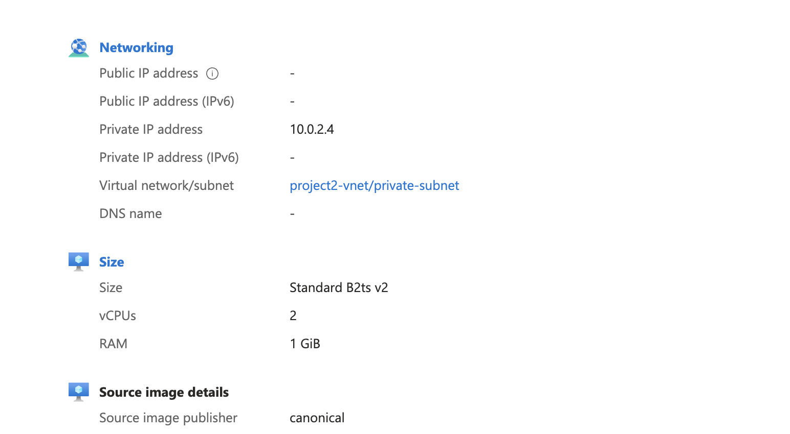

---

### Step 12: Verify Public VM (Jump Host)
I confirmed that the public virtual machine exists and will be used as a jump host to access the private VM.

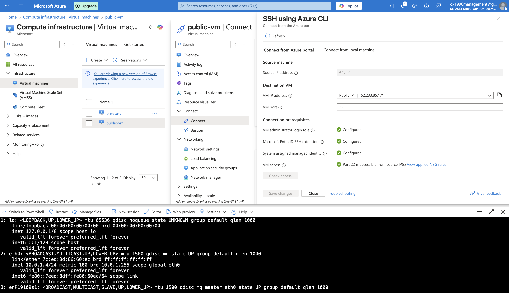

---

### Step 13: SSH into the Public VM
I successfully connected to the public VM using SSH to prepare for accessing the private VM internally.

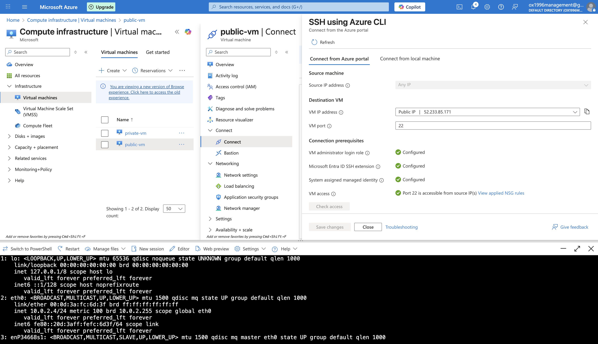

---

### Step 14: Validate Private VM Network Access
I verified network connectivity from inside the virtual machines using command-line tools.


---

## Summary

This project demonstrates my ability to design, secure, and validate Azure cloud networking components using industry best practices. I implemented subnet isolation, Network Security Groups, and secure SSH access, and verified network behavior through hands-on testing and documentation.
